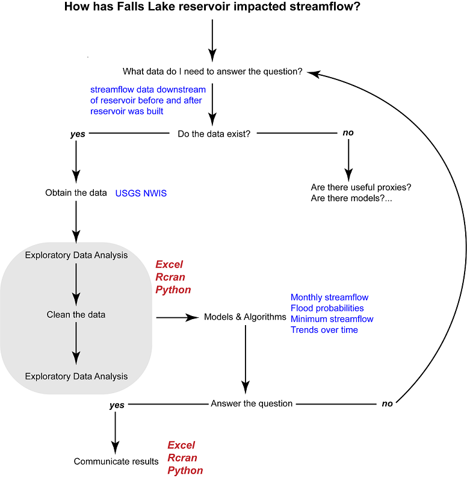

[Water Data Boot Camp: Fall 2019](./index.html)

# Unit 1: Analysis of Streamflow Data using Excel

[TOC]

## ♦ Background: How has Falls Lake affected streamflow?

Prior to 1978, flooding of the Neuse River caused extensive damage to public and private properties including roadways, railroads, industrial sites, and farmlands. The Falls Lake Project was developed by the U.S. Army Corps of Engineers to control damaging floods and to supply a source of water for surrounding communities. Construction of the dam began in 1978 and was completed in 1981. In addition to recreation opportunities, Falls Lake now provides flood control, water supply, water quality, and fish and wildlife conservation resources ([source](https://www.ncparks.gov/falls-lake-state-recreation-area/history)).

Now, some 3 dozen years after Falls Lake was constructed, we want to evaluate its impact on downstream streamflow, using this as an opportunity to examine some data analytic techniques, specifically ones using Microsoft Excel. These techniques will cover ways to get data into Excel and how to manage, wrangle, and analyze those data. 

This document begins with a review of the **analytical workflow** of most data projects. We apply this workflow to understand how streamflow has changed since Falls Lake was constructed. In doing so, we focus on using *Excel* to tackle the assignment, but companion documents will examine how *R* and *Python* can accomplish the same set of tasks in a scripting environment.

---

## ♦ Analytical workflow: A Preview

Data analysis projects follow a similar workflow, one that begins with a general question or objective that guides our process of turning data into actionable information. Let's begin by examining our workflow, depicted in the diagram below. 

### 1. Clarifying the central question

Data analysis has a workflow that often begins with clarifying the central question. For example, our initial question is *"How has Falls Lake affected streamflow?"* This question has some useful specifics: We know where we'll be working (Falls Lake) and what the core dataset will be (streamflow). However, the question is vague on how we might evaluate the impact on streamflow. As a data analyst your first job is often to <u>clarify a basic question into one that is *actionable*</u>, that is taking a vague question and creating specific questions that shape data exploration and analysis to facilitates effective decision making. 

This step usually requires some communication between the the client, project managers, experts in the field, and you, the data analyst. (And let's hope it goes better than this meeting: https://www.youtube.com/watch?v=BKorP55Aqvg .) For our Falls Lake example, however, we'll assume this meeting took place and narrowed on on the following questions:

* What do monthly streamflows look like? Have they changed since building the reservoir?  
* How has the 100-year flood frequency changed since building the reservoir?
* How have 7-month minimum flows changed since building the reservoir?
* Are there trends in streamflow (increasing, same or decreasing) since building the reservoir?

While these are still a touch vague, our expert hydrologists will provide more specific guidance on these analyses below. 

### 2. What data do I need to answer the question? Do the data exist?

With our objectives clarified, our next step is to <u>identify the data needed for our analyses</u>. In our case, it's fairly obvious: we need long-term streamflow data at some point downstream (and not too far downstream) from Falls Lake. In other cases, it may not be as obvious and may require another conference with the project team to figure out what that ideal dataset may be. 

When a target dataset is identified, the following question is <u>whether those data exist</u>? Knowing where to look or whom to ask whether a certain dataset exists comes with experience and your networks (though web-search skills can be quite useful too). However, if you've exhausted your search and still can't find the proper dataset(s), your fallback is to look for **proxies**, or similar (existing) data that can be used in place of your [missing] data. In some cases, **models** can be used to derive suitable data to run your analysis. 

In this case, the data we want are provided by the USGS' *National Water Information System* (NWIS). 

### 3. Obtaining, exploring, and cleaning the data

Data come in a variety of forms and formats. Some datasets lend themselves to easy import and immediate analysis; others may not be digital-ready (e.g. hard-copies or PDFs) or have an inconsistent format rendering them essentially useless. As the saying goes, "your mileage may vary" with the dataset you find. While there are techniques, technologies, and some tricks in getting messy, seemingly irretrievable data into a workable format, that is not our focus. Rather, we'll cover some reliable techniques for <u>getting data into a workable, or **tidy** format</u> in Excel. More powerful techniques exist for obtaining and cleaning data exist in *R* and *Python* scripting languages that we'll examine a bit later.

### 4. Conducting the analysis and communicating the results

With the proper data in your analytical environment (e.g. *Excel*, *R*, *Python*), the remaining steps in the data analysis workflow involve answering your question(s). How this goes ultimately depends on your particular objectives, but in this exercise we will examine a few basic strategies for working with data. These include:

* Selecting and subsetting specific observations (rows) and variables (columns) of data.
* Reshaping or changing the layout of your data, e.g. pivoting or transforming rows and columns
* Grouping and summarizing data
* Combining datasets
* Graphing, charting, and plotting data

### 5. Post-mortem: evaluation and documentation

Often overlooked by the data analyst is the step of reviewing your analysis and documenting your work. When you've completed your analysis, you'll often reconvene with the team and assess whether you answered your central question effectively. If not, you'll need to tweak things until you do and perhaps cycle through the workflow again. This is where **documentation** can be hugely helpful. Documentation includes notes to yourself and to others covering in enough detail as to facilitate repeating the entire process. Documentation should include any non-obvious assumption or decision made in doing your analysis. This can be a bit cumbersome with Excel, but is done quite easily through comments in R or Python scripts. 

---

## Exercises -

- ### <u>Task 1</u>: [Exploring monthly stream flows](./Streamflow_Task1.html)

- ### <u>Task 2</u>: [Evaluating changes in 100 & 500 year floods](./Streamflow_Task2.html)

- ### <u>Task 3</u>: [Evaluating changes in minimum flows](./Streamflow_Task3.html)

- ### <u>Task 4:</u> [Evaluating annual stream flow changes over time](./Streamflow_Task4.html)