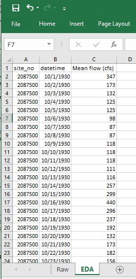
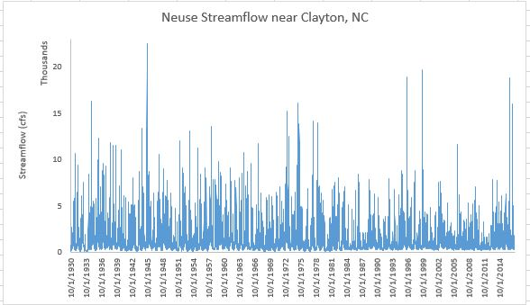

[Water Data Boot Camp: Fall 2019](./index.html)

# Unit 1: Task 1 Comparing Monthly Stream Flows Below Falls Lake

Here we apply the Analytical Workflow introduced in the previous document. The general question posed to us is: **How has the construction of Falls Lake altered monthly stream flow?** Let's explore how we might tackle this question using our framework. 

---

## 1. Clarify the question into an actionable task

The initial question - "How has the construction of Falls Lake altered stream flow?" - is fairly specific, but it still includes a few vague aspects we need to clarify before making it actionable. We know we'll be looking at a specific location (somewhere downstream of Falls Lake) and a specific time range (before and after construction of Falls lake in 1980-1984). However, it's up to us to define the metric used to measure stream flow (cfs? cms? mgd?) and what defines "altered stream flow". 

Ideally, you'd consult your team to clarify these issues, but often the answer is to "figure that out yourself and get back to me". Since the issues seem somewhat minor, we'll take the approach of making decisions as we go. Perhaps data availability will dictate what we measure streamflow in, and perhaps we'll provide some plots of streamflow that will allow others to interpret whether Falls Lake "altered" streamflow...

---

## 2. Obtain, explore, and clean the data

As mentioned above, we've determined that we need streamflow data for some site below Falls Lake dam, and those data are provided via the USGS' National Water Information System. The following steps outline the process of finding the appropriate gaging site and then the data we need to run our analysis. 

### ♦ <u>Finding the streamflow data</u>

1. Open the NWIS mapper in a browser: https://maps.waterdata.usgs.gov/mapper/index.html

2. Locate Falls Lake on the map. (Tip: Search for `Falls Lake, NC`)

3. On the map, visually follow the stream flowing out of Falls Lake dam until you find a gage site. Click on it, and it should reveal Site #: `02087500`, `NEUSE RIVER NEAR CLAYTON, NC`. This is the site we'll use for our analysis. 

   

4. Click on the [Access Data](https://waterdata.usgs.gov/nwis/inventory?agency_code=USGS&site_no=02087500) link. This brings up the interface for selecting which data you want to grab. 

5. On this page, from the dropdown menu near the top, select `Time-series: Daily Data` and hit `GO`. This will open the form for selecting the current and historical stream flow data we want.

6. In this form:
   \- Check the box next to `00060 Discharge`;

   \- Select `Tab-separated data` and `Display in browser` as the output format;

   \- Set the From date to `1930-10-01` and the End date to `2017-09-30` (note: the "water year" goes from Oct. to Sept.);

   \- And finally hit `Go`. This will call up a page with all the data you just requested. 

   
   
   → If needed, this [LINK](https://waterdata.usgs.gov/nwis/dv?cb_00060=on&format=rdb&site_no=02087500&referred_module=sw&period=&begin_date=1930-10-01&end_date=2017-09-30) will take you directly to the data...

Pause and look at what's provided. The first several lines begin with a '#' and display the dataset's *metadata*, i.e. data about the data. The first line without the '#' appears to be column headers, but the line after that looks different than the actual data values below that. (As it happens, this line indicates the data *length* and *type*: `5s` indicates a `s`tring that is `5` characters long. The other data types include `d` for *date*, and `n` for *numeric*.) 

### ♦ <u>Getting the data into Excel</u>

> \**Before embarking on our work with Excel, be sure you are clear what each of the following refers to with respect to Excel:* `workbook`, `worksheet`, `row`, `column`, `cell`, `menu options`.

Now that we have found the data, we need to get it into *Excel* so that each value is in its own cell. We'll discuss two, somewhat imperfect, methods to do this, each requiring a bit of manual editing. We also present a third, more automated method. However, while this third method may seem easier, it is less transparent and a bit unstable with the current release of *Excel*.   

#### Method 1

- Select the entire contents of the web page containing the discharge data. (Tip: use `ctrl`-`a` )
- Copy (`ctrl`-`c`) the contents from the browser and paste (`ctrl`-`v`) them into a new *Excel* worksheet. 

  *Notice that the contents are lumped into a single column, which prevents us from properly working with the data. To fix this, you can use the `Text to Columns` command .*
- To convert text to data, first select the cells containing text you want to convert into columns. For us, its the entire first column, which you can select by click the header of Column `A`.
- From the `Data` menu, click the `Text to Columns` command in the `Data Tools` panel. 
- In the wizard, specify that your data are `delimited` by a `space`, and then click `Finish`. 

*This works, but not perfectly. Notice the data (starting in row 33) are in columns now, but the column headers don’t match the data fields until 2004 (row 27,062) when minimum and maximum discharge were collected. <u>Thus, we need to be careful for these types of errors using this method.</u> Let's look at an alternative method and see whether it works better...*

#### Method 2 

- Oddly, for this method to work, we need to restart Excel. So close your current instance and re-open Excel.
- Clear the contents of your Excel spreadsheet, and copy the contents of the NWIS data web page again, if necessary.
- In your blank worksheet, right-click cell A1 and select `Paste Special...` from the context menu.
- In the Paste Special wizard, select `text` and hit `OK`. Notice that the data are in the correct columns!
- Rename the worksheet "`Raw`" and save your workbook. 

#### Method 3 

*(Note, this method is somewhat buggy and may take a bit longer to run...)*

- From the `Data` menu, select `Get External Data` and then `From Web`. 
- In the `New Web Query` window, copy and paste the NWIS data web page's [URL](https://waterdata.usgs.gov/nwis/dv?cb_00060=on&format=rdb&site_no=02087500&referred_module=sw&period=&begin_date=1930-10-01&end_date=2017-09-30) into the `Address:` box and click `Go`.
- You'll see the data appear in this window; Click the orange arrow to select the data to import.
- Click the `import` button. 

Once you have your data imported, rename the worksheet to `Raw`. We'll be adding more worksheets to your Excel workbook and this will help identify which contains the original, raw data. 

### ♦ <u>Cleaning the data</u>

While we now have the data we need, we should take a moment and **tidy** it up to facilitate analysis. (Hadley Wickham has an excellent paper on tidy data here: http://vita.had.co.nz/papers/tidy-data.html). We'll begin by creating a tidier version of the raw data, but keeping the raw worksheet intact in case we make a mistake and need to revert to it. And with this copy, we'll remove the metadata and other extraneous items so that we have a clean, efficient dataset, ready for quick analysis. 

- **Create a copy of your `Raw` worksheet and rename it `EDA` (for exploratory data analysis):** 
  
- Right click the `Raw` worksheet tab, and select `Move or Copy...`
  
- Be sure, `create a copy` is checked and click `OK`. 
  
- Right click on the `Raw (2)` worksheet tab and select `Rename`
  
- Type in `EDA` as the new name
  
  ​		<mark>**---All further work will be done in this EDA worksheet ---**</mark>
  
- **Delete the metadata rows and the data type specification row (rows 1-31 and 33):**
  * Select the entire row by selecting the row number. Use `shift-click` to make continuous selections and `ctrl`-`click` to make disjunct selections.
  * Right-click and select `Delete`. 

- **As we are only interested in *mean* discharge, we can remove the other columns:** 

  * Delete all columns but `site_no`, `datetime`, and mean discharge, currently labeled `85235_00060_00003`. 

  * Rename the `85235_00060_00003` as `Mean flow (cfs)`

    * How did we know the units are cfs? The metadata. Can you find this information?

    ***\* Note: It's always good to include the units in a field name!***

### ♦ <u>Exploring the data: Plots</u>

While we now have our data in Excel, we should explore and inspect the data before we dive into our analysis. This may expose irregularities in the data, stemming either from our import process or in the dataset itself. **Plots** and **summary statistics** are a quick way to reveal any data gaps or outliers. We'll begin by looking at scatterplots of the data. 

##### Create a scatterplot of discharge over time:

* Choose the data you want to plot:

  * Highlight cells **B1** and **C1**.
  * Press `ctrl`+`shift`+`↓` to select all data cells beneath your initial selection.

* Create a scatter plot with straight lines from your selected data:

  * From the **Insert** menu, over in the **Charts** panel, select the **scatterplot** dropdown, and chose an appropriate chart type given the data. (Straight lines makes sense since our data are based on measurements.)

  

  > *Notice that the X-axis contains an odd sampling of dates and lots of dead space on either side. Different plot types behave differently in Excel, and scatterplots are finicky with dates, so we need to either manually adjust the x axis or chose a different plot type. We'll examine both ways...* 

* Format the X-axis to eliminate empty data space:

  * Double-click the x-axis to open the *Format Axis* menu.
  * In the *Format Axis* panel, click the *Axis Options* icon (looks like a bar chart). 
  * Notice that the axis bounds are currently set from 0 to 50,000. To set these to our data's minimum and maximum values, just type them in as dates, e.g., `1930-10-01` and `2017-09-30`. 

* **Or**, you can convert your scatterplot to a 2-d line plot.

  * With the chart selected, and the `Design` tab active, select `Change Chart Type` to switch your scatterplot to a line plot. *Notice you can preview the design of a chart before committing to it.*
  * Notice that the date format is much tidier with a line plot...

##### Adjust the aesthetics of your plot

* Double-click the chart title and change it to something meaningful, such as “Neuse Streamflow near Clayton, NC”
* Add a y-axis label: **Design** -> **Add Chart Element** -> **Axis Titles** -> **Primary Vertical**
  * Enter something useful like "Streamflow (cfs)"
* Change the y-axis bounds:

  * Set the maximum to 23,000; note the minimum drops to -2000. Change the minimum back to 0.

  * Set the display units to *Thousands*. 

* Play with the colors, font sizes, borders, etc. 
  * Delete the gridlines
  * Try setting your plot to use narrower lines to show more detail. 

### • *Task: Altering the units of your data*

*You remembered that scientists like the metric system and you need to convert the data from cubic feet per second to cubic meters per second. You'll need to create a new column with the discharge values in these units and re-create a new plot. Here are the steps:*

* **Add a header in column `D`: "Mean flow (cms)"**
* **Compute cms values from your cfs ones:**
  * In cell `D2`, enter the formula `=C2*0.028316847` (0.028316847 is the conversion rate from cfs to cms). 
  * To carry this formula down to all records, double click on the bottom right corner of the `D2` cell.
* **Check that the new values appear correct:**
  * First, lock the header row so it doesn't disappear when scrolling
    * Set the active cell as the top left cell `A1`(tip: try clicking`ctrl`-`home` )
    * Highlight Row 1 by clicking on the row header for the first row, i.e, the `1`.
    * From the View menu, select `Freeze Top Row`
    * Scroll down and examine the Discharge (cms) data. Note the header row stays put!
* **Re-plot the data in cubic meters per second.** 
  * Select your existing plot and click on the data line. That will indicate the columns of data on which the plot was based. 
  * Click on the side of the blue rectangle and drag it so that it covers the column D, not C. 
  * Change the y-axis label and bounds. 
  * Reformat other aesthetics as needed...
    * Change the scale and label of the y-axis

---

## ○ EXERCISE 1: Altering units and plotting

Your project manager looks at the chart but doesn’t like the metric system. Add a new column to convert discharge to millions of gallons per day. <u>Make a new plot and show side by side to the "cfs" or "cms" plot</u>. (`1` CFS = `0.53817` MGD)

---

### ♦ <u>Exploring the data: Grouping and summarizing data</u>

<u>**Know your data**.</u> Whenever you get data, it’s good practice to look at and understand the raw data to make sure it looks reasonable and you understand something about its quality and content. One of the first things to assess in the metadata is how confident you are in the quality of the data being used in your analysis. Is the data fit for purpose?

##### How confident are we in the data?

Our data included data-value qualification codes, and indication of the confidence we can have in the values reported. Let's examine our data in terms of those codes. We deleted these data from the table, so we'll have to add them back in to the data in our EDA worksheet. 

* **Add a new column header to the table in the EDA worksheet; name it `Confidence`.**

  *We could copy and paste the data back into our table, as we haven't moved things around. However, it's useful to know how the vertical lookup, or* `VLOOKUP` *function works to join data from on table to another using a common joining field.*

* **Under the `Confidence` header you just created, enter the formula: `=VLOOKUP(B2,Raw!$C$33:$I$31809,7,FALSE)`**

*<u>There's a lot going on in that VLOOKUP formula, so lets explain it.</u>* 

*First, the VLOOKUP function looks up a value by matching a given value in one table to a given value in another table, specified by a range of cells. In our example, this matching value is in cell `B2`, i.e. the date `10/1/1930`. VLOOKUP searches the range of cells specified in the second argument, `Raw!$C$33:$I$31809` for that value, and returns the value in the `7`th column of that range.* 

*What still may be confusing is how the range of cells is defined by `Raw!$C$33:$I$31809`. Here, `Raw!` tells Excel that the range of values is in the worksheet named "Raw", not the current worksheet. The range of cells in the "Raw" worksheet is `C33` to `31809`, but the `$` indicates that, as we copy this formula to other cells, this range should remain static. Otherwise, if we copied the formula to the cell below it the range would dynamical update  from `C33:I31809` to `C34:I31810`, but in our case, we want the lookup range to be locked in.* 

* **Double click the bottom corner to copy this function down to all records in our table.** Now we have re-added the confidence values back to our data table!

Now, let's add into our worksheet a table listing how many records are associated with each confidence value. A look at the metadata indicate three data-value qualification codes: *A*, *P*, and *e*. Let's first confirm what values are contained in our dataset. We can do this quickly by setting up a data filter:

* **Create a Filter for the `Confidence` column to reveal a list of unique values**
  * Select the entire Confidence column.
  * With the **Home** menu active, select **Sort & Filter**>**Filter** (from the **Editing** panel)

You'll now see that the header cell has a dropdown arrow. Click this arrow and it will list all the unique values, and you'll see that our data indeed has three values, but they are slightly different than what was listed in the metadata. They are: **A** and **A:e**. 

Now to create the table listing how many records are associated with these three values. The `countif` tool is useful here.

* **Create a table listing the number of records associated with each Confidence code using COUNTIF** 
  * Somewhere in your EDA worksheet, create two header cells: `Confidence code` and `Count`.
  * Under the `Confidence Code` header cell, enter three label cells, one for each confidence code: `A` and `A:e`.
  * To the left of each label cell, start typing the formula `=countif(` 
  * To specify the *range* portion of this formula, select the top data cell in the Confidence column (E2), and then press `shift`+ `ctrl`+`↓`. (It should result in `E2:E31778`)
  * To specify the *criteria* portion of the formula, select the label cell containing the confidence code you want to count. This should be immediately to the left of the cell into which you are typing the formula. The value for `A` should be `31601`.
  * Before copying this formula down, you need to add `$` to your range so that it remains locked in: Edit the range in your formula from  `E2:E31778` to  `E$2:E$31778`.
  * Now, double-click the lower right corner of the cell to copy the formula down for the other two confidence codes. 

With this table you can interpret the results. What proportion of the data is reliable? Would a plot be helpful?

##### Examine Summary Statistics of our Data

Summary statistics provide another quick way to examine our data for peculiarities. Here, we'll outline the process for computing min, max, mean, and percentiles from our data in Excel. We'll simplify this procedure by creating a name for the range of `Mean flow (cms)` data cell. 

* Assign `CMS` as the name of the range of `Mean flow (cms)` cells:
  * Select all the data cells under the `Mean flow (cms)` header
  * Type `ctrl`-`F3` to open the Name Manager and click `New` to add a new named range of cells.
  * Enter CMS as the Name. Note the range is set to what we highlighted as we open the Name Manger. Click `OK`.
  * Close the Name Manger. Now we can just type `CMS` in any formula and it will refer to that range of cells. We'll see below how this works. 
* Create a skeleton table with labels: `Min`, `P10`, `P25`, `P75`, `P90`, `Median`, `Average`, and `Max`
* Insert the appropriate formula for each, using the range of `Mean flow (cms)` cells for each. 
  * min: `=MIN(CMS)`
  * P10:  `=PERCENTILE.INC(CMS,0.1)`
    * `INC` means inclusive: where the percentile value must be between 0 and 1
    * Alternatively, `EXC` requires the percentile to be between 1/n and 1-1/n, where n is the number of elements 
    * Calculate P25, P75, P90 following the same format
  * median: `=MEDIAN(CMS)`
  * average: `=AVERAGE(CMS)`
  * max: `=MAX(CMS)`

Now that we know how to compute summary statistics, let's examine whether building Falls Lake had a noticeable impact on these values. We can do this by computing summary statistics for subsets of the discharge data, with one subset containing the discharge before 1980, when construction of the lake started, and after 1984, after the dam was completed. 

* Create named ranges for discharge data before 1980 and after 1984
  * A quick way to do this is search for 1980 and select 12/31/1979 and up with `shift`+`ctrl`+`↑`. With these records selected, assign a name as we did above. 
  * Then search for 1984 and select from 1/1/1984 and down (`shift`+`ctrl`+`↓`), and name that range. 
* Compute summary stats for these new ranges as you did above. (Tip: you can use `ctrl`+`H` to replace the named range `CMS` with the new names you created for easy update.)

What do you notice? Particularly with regards to min and max streamflow. Does that make sense given what you know about reservoirs?

##### Is there seasonal variation in streamflow?

To examine seasonal (or monthly) variation in streamflow, we need to extract the months from our date values. We'll also convert calendar years into water years, which run from October thru September. 

* Parse out the Date to include Year and Month
  * Insert three new columns in your EDA worksheet by right-clicking on Column C and selecting `Insert` three times.
  * Name these columns `year`, `month`, and `water year`
  * In the Year column, use the `=Year()` function to extract the year from the corresponding cell in the `datetime` column. The result will look weird, but we'll fix that in a moment.
  * Repeat for the month column using the formula `=Month()`. 
  * Change the format of these cells from *General* to *Number* by highlighting the columns and selecting `Number` from the dropdown list in the **Number** panel in the **Home** menu. 
  * Extend these formulas to the cells below. 
* Water year runs from October to September. We adjust the year column to account for this information using `IF`
  * Use the `IF` function to assign the value to the cell in the `year` column if the month value is `< 10`, otherwise, set the value of the year column plus 1:  `=IF(D2<10,C2,C2+1)`.
  * Change the format of the cell from General to Number, if necessary. 
  * Extend the formula to the cells below, examining to ensure the calculations are correct. 
* Create a table skeleton of average streamflow by month (1-12) over the different time periods (period of record, pre1980, and post1984)
* Use the `AVERAGEIF()` function to compute the average discharge of records where the month equals the specified month. Here, the *range* will be the range of cells in the month column, the criteria will be the month (e.g. '1'), and the average range will be the range of discharge values.

*What do you observe? Would a plot of the results facilitate interpretation?* 

---

## ○ Exercise 2: Compute total streamflow by water year

Repeat the above using `SUMIF` for annual streamflow based on the <u>water year</u>.

---

END
