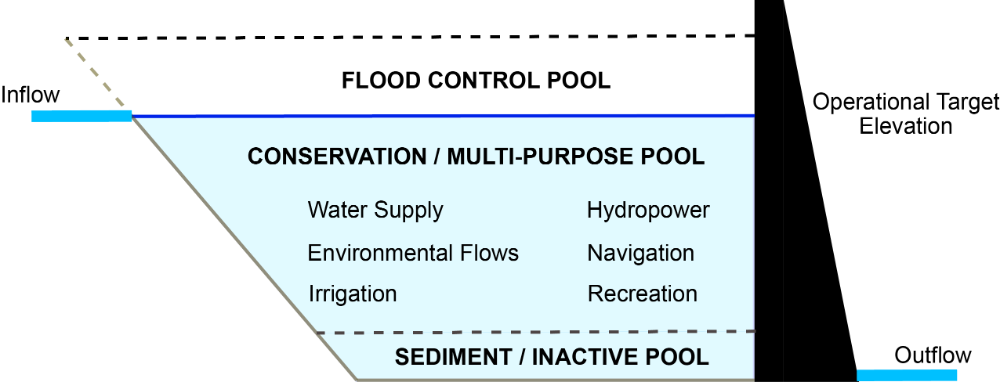
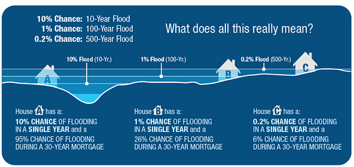

[Water Data Boot Camp: Fall 2019](./index.html)

# Unit 1: Task 2 Evaluating 100-year flood frequency

Our team hydrologist suggested that one method for evaluating the impacts of dam construction is to monitor changes in **flood return intervals**. Falls Lake is a flood control reservoir, so it should decrease the amount of downstream flooding.

 

***Figure**: Reservoirs should moderate downstream flows. There is a flood control pool to hold flood waters that can be released slowly over time. There is also a conservation pool that holds water that can be released downstream during drier conditions to meet minimum streamflow requirements.*

Flood insurance policy is built around the concept of the 100-year flood event. The housing industry has been working to explain what that risk actually means to homeowners with 30 year mortgages. Understanding the flood risk relative to mortages is helpful for insurance companies to know. Has Falls Lake decreased the flood risk for downstream homes?

Reservoirs decrease the likelihood of downstream flooding, but that often means development occurs in areas that would have been frequently flooded prior to the reservoir. We’ve seen examples of this just quite recently with Hurricanes Harvey and Florence.

## Framing & Executing the analysis

We will use Leopold’s (1994) flood frequency curve and the Weibull equation to calculate the recurrence interval. Here the return interval is computed as $\frac{n+1}{m}$ where $n$ is the number of years of data and $m$ is the rank of the year from largest to smallest (see this [link](https://en.wikipedia.org/wiki/Return_period) for more info). 	

*\* NOTE: The accuracy of a return interval is highly affected by the length of the time series.*

So, for us to do this analysis, we need to first compute <u>maximum annual discharge</u>, i.e. **extract the largest discharge observed from each water year.** Then **we sort and rank our data on max annual discharge** and then **compute a regression line** from which we can determine the discharge of a 100 and 500 year flood. 

---

### 1. Computing maximum annual streamflow using <u>pivot tables</u>

Excel's pivot tables are one of it's more powerful features, allowing you to easily extract and cross tabulate various summaries from your data. We'll use to sift through discharge records on a per-year basis and identify the largest one. 

* Highlight your EDA table - all the columns up to and including "Mean flow (cms)", headers and all.
* From the **Insert** menu, select **Pivot Table**, choosing to place the report in a `New Worksheet`.
* Rename this worksheet "Flood".
* In the new worksheet created, click on the Pivot Table if the `Pivot Table Fields` dialog is not shown. 
* In the Pivot Table Fields dialog:
  * Drag the `Water year` field into the `Rows` section
  * Drag the `Mean discharge (cms)` field into the `Values` section
  * Using the dropdown menu next to the `the Mean discharge (cms)` item now in the `Values` section, change the `Value Fields Settings` to summarize the field by the `Max` value.  

### 2. Sorting and ranking the pivot table data to compute return intervals 

We now have the data we want. Next we'll compute rankings and then sort the data. However, to do this we need to copy the data from the dynamic Pivot Table.

* **Copy** contents of your pivot table

* **Paste** *the values* of the contents `right click`+`s`+`v`.

* **Delete** the last row in the pasted values (the grand total)

* **Rename** columns if needed (e.g. replace "Row Labels" with "Water Year")

* **Sort** the data from largest to smallest: 
  
  * Select both columns of data
  * From the Home menu, select Sort & Filter->Custom Sort 
  * Sort data by discharge values from largest to smallest. 
  
* Compute rankings in a new column named `rank`
  * Type in a few numbers, e.g., 1, 2, 3.

  * Select these numbers and double click the lower right hand corner of the selected range.

  * *Alternatively, you can use the* `RANK.EQ` *function*

    **Note: How do these methods differ for those years with the same maximum values (ties)?*

### 3. Compute Return Interval ($RI$) and Annual Exceedance Probability ($P_e$) 

Recall that the return interval is computed from the sorted and ranked time series data. Now that we have our data sorted and ranked, we compute $RI$ from the number of years of data we have (plus 1), divided by the ranking of a given year's discharge. 

* Calculate **Return Intervals** in a new column named `RI`
  * Determine $n$:  the number of years of data you have (e.g. count of year rows or max of rank).
  * Compute  $\frac{n+1}{m}$ where $n$ is the number of years of data and $m$ is the rank.

* Calculate the **Annual Exceedance Probability** in a new column named `Pe`
  * $P_e$ is just the invers of $RI$: $P_e = 1/RI$

### • Plot the data and compute a regression equation

* Create a scatterplot of max discharge (y-axis) vs. recurrence interval (x-axis)
  > Note: Excel will default to setting the left most column in your table to the X-axis and the other as the Y-axis, meaning your scatterplot will default to setting the X-axis to Max Discharge and the Y-axis to Recurrence Interval. You'll have to manually switch this using the `Select Data` tool. 
  
  In the Select Data Source dialog, Edit the `Series Name` category so that it points to the cell that is the header of the **Max Flow (cms)** column, and swap the `Series X values` and `Series Y values` so that **X** is pointing to the values in the `Pe` column and **Y** is pointing to the `Max Flow (cms)` column. The result should appears similar to this:
  
  
  
* Place the x-axis on a log scale and add minor tick marks.

* Add a regression line to your plot
  * Select the points in your plot; right-click and select **Add Trendline**.
  * Try out different trendlines to see which has the best fit. In our case, logarithmic.
  * Check the box to display the equation on the chart and r2 values.
  
* Set the aesthetics of your plot...

  

### • Apply the regression to compute 100, 500, and 1000-year flood discharges

Using the regression equation you just calculated and added to your chart, estimate the discharge for the 100, 500, and 1000 year events, i.e., compute `y` for `x` = 100, 500, and 1000, respectively, somewhere in your Excel worksheet. *These are the estimated discharge at 100, 500, and 1000 year flood events.* 

To do this, we'll create a table, listing the years for which we want to explore (100, 500, 1000):

* Somewhere in your spreadsheet, create row labels of 100, 500, and 1000. 
* Next to these, compute the projected discharge for these return intervals by applying the regression equation. 

Finally, we can add these points to our original plot

* **Select Data** > **Add** > *RI Year* goes to `X Values`, `Y Values` are the values computed from the regression.

---

### ♦ EXERCISE: Calculate the return interval from the pre-1980 data

Repeat the above analysis only <u>using data prior to 1980</u> to calculate the return interval.

* How many fewer years of data are used?

* Plot the new dataset on top of the original plot.
  * `Design` > `Select Data` > `Add`
  * Add the estimated 100 and 500 year points for each plot based on the regression.
* How big is the difference between the 100 and 500 year estimates?
  * Percent is calculated relative to the smaller record (my choice)
* Calculate the discharge for different return periods and exceedance probabilities
* Plot annual discharge and calculate the number of times the 100 year flood was surpassed for both the POR and prior to 1980
  * Plot the estimates on the same chart. How much do they differ? Are you surprised by the results?

*Look at the first plot you did of streamflow on the EDA spreadsheet to look at the distribution of peak events. These events are all hurricanes. How does it change your understanding of why Falls Lake doesn’t seem to impact flood frequency?* 

*What happens to your answer if you remove those three points?*

---

## Recap

We've now discovered how data can be transformed, or "Pivoted" into various summary formats and how, via Excel's plotting functionality, we can compute quick regressions of our data. 