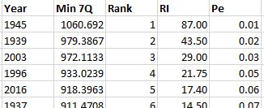

[Water Data Boot Camp: Fall 2019](./index.html)

# Unit 1: Task3 Evaluating impact on minimum flows

## Background: Minimum flows & "7Q10"

The passing of the Clean Water Act in 1972 and the Endangered Species Act in 1973 has resulted in many reservoirs having to meet downstream flow requirements for either water quality purposes or species protection. For example, at the Clayton gauge, minimum flow requirements have ranged from 184 to 404 cfs since 1983. ***Here we want to see if  the establishment of Falls Lake has raised minimum flows.***

There are many ways to approach low flow to understand how minimum streamflow has changed since Falls Lake was constructed. We will look at a common metric known as 7Q10. <u>**7Q10** is the lowest average discharge over a one [week/month/year] period with a recurrence interval of 10 years.</u> This means there is only a 10% probability that there will be lower flows than the 7Q10 threshold in any given year. 

To get more practice with pivot tables and if statements, we will calculate this metric using the 7 <u>month</u> period. **To do this we need to construct a rolling average of monthly discharges spanning 7 month, which we can do using a series of pivot tables**. 

The first pivot table aggregates our daily discharge data into total monthly discharge values for each year. From this we table, we can compute a *7-month rolling average of minimum-flows* from the given month's total discharge and those from 6 months preceding it. 

Next, we construct a second Pivot Table from the above data. This one aggregates the monthly data by year, extracting the minimum of the 7-month average for each year. This will enable us to compute a regression similar the one we constructed for the flood return interval, but this regression is to reveal the recurrence interval of low flows so that we can determine the streamflow of a 10% low flow event. 

We then sort and rank these annual monthly-minimum values, similar to how we computed flood return intervals to compute *7 month minimum-flow (7Q) return interval* and then the *low flow probability of recurrence (POR)* of these flows, again using the same methods used for calculating flood return intervals and probabilities of recurrence. From this we can compute a regression between our yearly 7Q flows and POR, and use that regression equation to determine 7Q10, or the expected minimum flow across a span of 10 years. 

## The analysis

#### 1. Compute average daily discharge by year and month via a Pivot Table

* Create a Pivot Table from the data in the EDA worksheet, sending the output to a new worksheet.

* Rename the new worksheet "7Q10".

* Set `year` and `month` as the Pivot Table *rows*. (We use year instead of Water Year to ensure the data are being read in the correct order. If we use water year, the wrong September and Octobers are matched together.)

* Set `Mean Flow (cms)` as your Pivot Table *value*. Ensure it is calculating the **sum** of the monthly flows (since taking lowest 7 month average, small variability in the number of days in each month is ok.

* In the field settings for both `year` and `month`, change the `Subtotals & Filters` to `None`.  *Did you notice what changes as a result of this modification?*

* Right click the top left `Row Labels` cell, and select PivotTable Options. 
  * On the `Totals & Filters` tab, un-check the two Grand Totals options. 
  * On the `Display` tab, check "Classify PivotTable layout..." This "flattens" your table to that year is shown in one column and month in another.
  
  
  
  At this point, your pivot table of total monthly flow should appear like this: 
  
  

#### 2. Create a static copy of the Pivot Table values

* Copy the the entire Pivot Table data and paste - as *values* - into cell `F1`. (It can go anywhere, but this will make the subsequent steps easier to follow.) Delete the cells labelled "(blank)" at the bottom of the pasted values. 

#### 3.  Fill all the blanks in the year column with the appropriate year. 

* Select all the cells in the newly pasted **Year** column
* Click **Home** > **Find & Select** > **Go To Special…**, and a `Go To Special` dialog box will appear.
* Check the  `Blanks` option, and click `OK`. All of the blank cells have been selected. 
* Then input the formula `=F3` into active cell **F4** without changing the selection. 
* Press `Ctrl` + `Enter`, Excel will copy the respective formula to all blank cells.
* At this point, the filled contents are formulas, and we need to convert the formals to values. Now select the whole range, copy, and paste as values.

#### 4. Calculate the 7-month minimum flow averages (i.e., "7Q")

* Add a new column next to the records you just pasted. Give it the header `7Q`.
* Go to the 7th cell down and set it to compute the average of the streamflow of that row and the preceding 6 rows.
* Double-click the bottom corner to copy this formula down to the cells below. 

#### 5. Create a new pivot table listing the minimum 7Q flow for each year, using the above table as its source. 

* Hint: Use your pivot table skills. But you may want to create the table in the same worksheet.

#### 6. Compute the rank, return interval, and probability of recurrence of these minimum flows

* Hint: Use the methods from the flood lesson, but remember to sort in the opposite direction!

#### 7. Plot the 7Q flow (Y) against the Probability of Recurrence (X)

* Try different regression types and stick with the one with the highest R2 (but avoid *quadratic* or *moving averages*).

#### 8. Use the equation to estimate the 7Q10, i.e., the threshold where the 10% of the observed flows are smaller:

* Set `x` in the regression equation to 0.10 and find `y`. This is your 7Q10. 

* Add the 7Q10 point to the graph using `Select Data...` with your plot active. 

  

#### 9. Apply your results: How many months in the monthly Pivot Table fell below the estimated 7Q10?

Here we want to produce a plot that shows when and how frequently low flows have occurred. We do this by first created a new column of just the monthly discharges falling below our 7Q10 threshold, and then creating a plot where these are highlighted against all monthly discharge values. 

* Insert a new column to the left of your copied and pasted monthly Pivot Table results. Label it `Below 7Q10`. 
* Use the `IF` formula to set values in this column to the monthly discharge value if the monthly discharge was below your computed 7Q10, otherwise set to an empty string (`""`). 
* Label the empty column to the right of this table (Column E) "Date" and set it cells to the 15th of the year and month of the record, using the formula `=Date(year,month,day)`
* Plot the monthly discharge. Then add a new series to your plot of just the ones falling under the 7Q10 (column J).
* Add labels and a legend.

#### 10. Count the number of Q710 events per year:

* Either use the `COUNTIF` function, or
* Expand your Pivot table to include the `Below 7Q10` column and count the number of occurrences. (`PivotTableTools` > `Change Data Source...`).

---

## Continued practice

* On your own - calculate the 7Q10 prior to Falls Lake and after Falls Lake
