# Unit 3: Part 1 - Visualizing Data in *Tableau*

### ♦ Introduction

Here, we test drive Tableau with some water use data pulled from the USGS servers. We'll examine how to get data into a Tableau session, how to best organize our data, and how to construct various plots and charts with our data. We'll also examine Tableau's "dashboard" and "storyboard" features. 

---

## ♦ USGS Water Use data, an overview

The USGS collects and reports water use on 5-year intervals. The latest data released was from 2010. Go to the USGS Water Use website (https://water.usgs.gov/watuse/). Notice they provide some overviews of the data. Click on the different overviews. What do you notice? Is this information helpful? Would this information be more engaging if we could explore different state water use?

#### Obtaining the data & spreadsheet etiquette

From the USGS website, download the state data for [2010](https://water.usgs.gov/watuse/data/2010/index.html).

 * Download and examine the [Formatted tables, Excel .xlsx format](https://water.usgs.gov/watuse/data/2010/USGSCircular1405-tables1-14.xlsx). *Based on what we have learned in previous sessions, is this type of spreadsheet particularly usable? Why or why not?*

This is a frequent problem with water data. You might be able to discover the data, but the data are not in a format that is immediately usable. How would you reorganize the data to be more usable?

* Download and examine the unformatted version [Excel format](https://water.usgs.gov/watuse/data/2010/usco2010.xlsx). How does this format compare to the previous one? Better? Worse?

While this latter format is better suited for data analysis, we have further modified it to provide a good working example for learning Tableau. This is saves as the file called `State_Data_Formatted.xlsx`, which can be downloaded [here](https://github.com/ENV872/Water-Data-Bootcamp/blob/master/3_WaterQuality/data/State_Data_Formatted.xlsx?raw=true). 

* Download a local copy of the  `State_Data_Formatted.xlsx` workbook, and examine its contents. 

---

## ♦ Tableau

We'll start exploring Tableau's analysis environment by making a simple plot with our water use data. Specifically, we'll construct a simple stacked bar plot of water withdrawals by category, limiting our data to fresh water withdrawals only. In doing so, we'll cover some basics such as: reading data in, joining tables, setting up plots, and manipulating plots. 

Then we'll see if we can mimic some of the USGS' exploratory products. 

### Loading data into Tableau

Tableau accepts several data formats, including Excel spreadsheets. You can also connect to remotely served data such as [Google Sheets](https://www.google.com/sheets/about/). However, to keep it simple, we'll just load in our local Excel spreadsheet. 

- Select `Microsoft Excel` under the `Connect` menu. Navigate to where the data are held.

- On the left-hand side we see that we are connected to the `State_Data_Formatted.xlsx` spreadsheet. Underneath the connection you see both `worksheets`. Drag the `WaterUse` sheet into the top right panel.

- Make sure the data loaded into Tableau correctly:

  - Data Column Headers

  - Data Types

    - Geographic types are pre-loaded into Tableau

### Joining tables

We want to connect data in our `WaterUse` worksheet with the data in the `Population` worksheet. We do this by joining the two tables.

- Drag the population sheet into the top right region of the workspace.
- Types of joins...
- Select the fields to link too: `State`
  - Linking population and water use data together will allow us to calculate the per-capita water use later on.

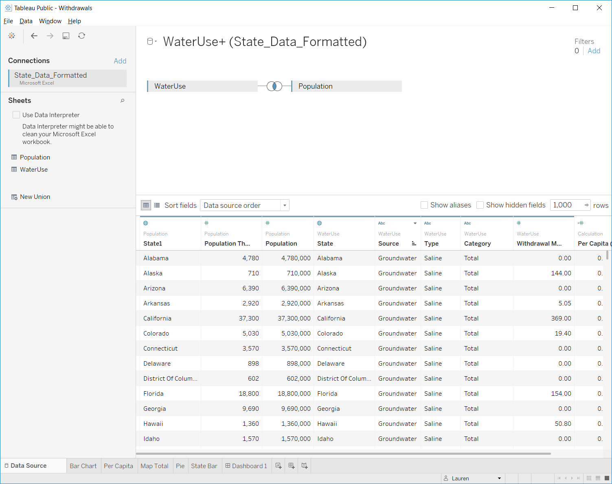

### Navigating Tableau

The bottom row of the Tableau workspace contains tabs for the different objects you've created as well as links to create new objects.  

- `Data Source` - the raw data we load into Tableau
- `Worksheet` - spreadsheets where we create visualizations to explore the data
- `Dashboard` - organize visualizations onto a page. Can set up connectivity and interaction of different charts.
- `New Story` - organize dashboard(s) in an order to walk users through the analysis

### Working with worksheets

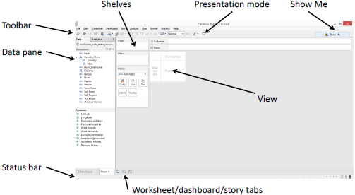Worksheets

##### The Data pane:

- *Dimensions* are discrete data. These set the level of detail in your visualization.
- *Measures* are continuous data. These values will be aggregated for each level in your selected dimension(s), and you specify how they are aggregated (mean, max, count, etc.).
- Italicized variables are calculated by Tableau on the fly.
- You can change how data are categorized, i.e. dimension or measures by dragging or by right clicking the variable and selecting the operation you want to perform.

##### Constructing a visualization:

- Drag `Withdrawal MGD` into the main area of the sheet. What do you see? Tableau will always summarize information. You can then ask it to break out that information into <u>categories</u>.

- Drag `Source` into the `Columns` "shelf". You can think of columns as your **x-axis** and rows as your **y-axis** in terms of how the data will be displayed.

  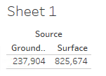

*How else can we summarize the data?*

- Add `Type` as a column header.

  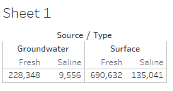

*Notice that as you drag information over, new data summaries begin to come up. These are different options that Tableau recommends for displaying the information.*

- Drag `Category` into the `Rows` tab.

  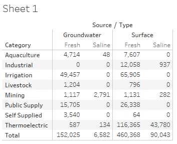

- Create a `stacked bar` chart by clicking the appropriate icon on the right hand side. 

  - *How did Tableau organize the information?*
  - *How did Tableau order the data in the bar chart?*

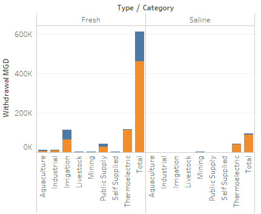

*It's a little hard to see - what if we flipped the orientation...*

*  Use `Ctrl`-`W` or  the `Swap Rows and Columns` tool to transpose the data. The stacked bar plot will update...

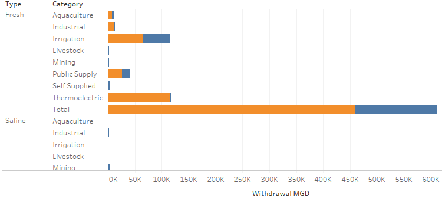

*Notice that `Total` is making the `Withdrawal` axis very long. Remove the `Total` column.*
- Right-Click on `Total` and click `exclude`

- Let's focus only on freshwater. Can you exclude `Saline`?

- Can you sort the column <u>data</u> from descending to ascending?

- Name your worksheet something meaningful; it will update the name of your table.

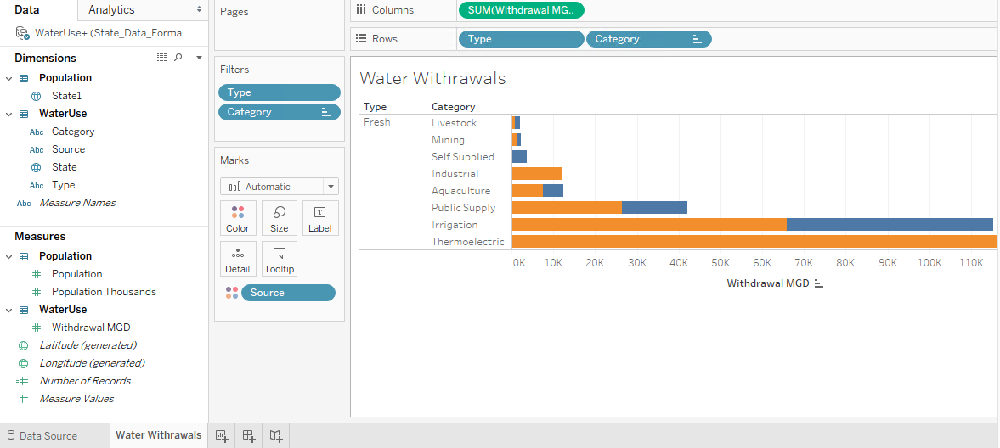

##### Create a new worksheet and this time let's plot *per capita* water withdrawals.

- `Duplicate` the worksheet you just created and rename it "Per Capita Withdrawals"
- Under `Measures`, click on `Withdrawal MGD`. Click `Create`, `calculated field`
  - Name this calculated field `Per Capita (MGD/person)`
  - Calculate the per-capita water use (mgd/person) as `[Withdrawal MGD]/[Population]` (You can type or drag fields into the box...)
- Drag `Per Capita (MGD/person)` field into the columns chart and remove  `SUM(Withdrawal MGD)`. 

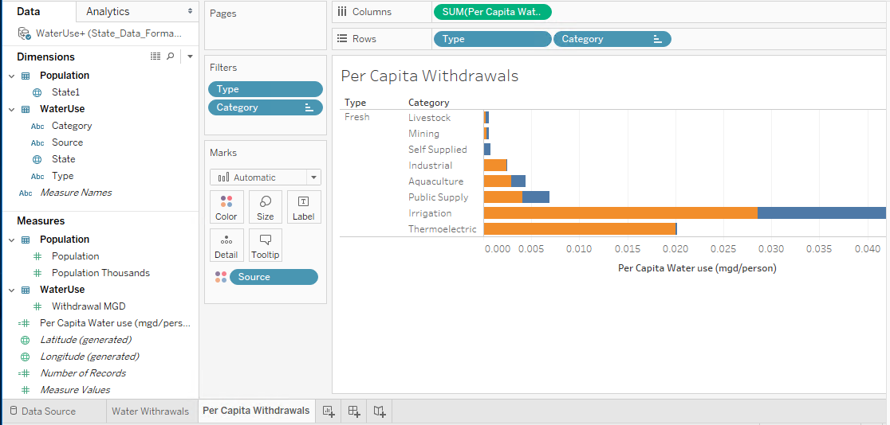

### Recreate the charts shown on the USGS website

#### 1. Bar chart: https://water.usgs.gov/watuse/wuto.html 

Let's explore more of Tableau by attempting to recreate the USGS figure shown here:

- In Tableau, create a new worksheet and title it `Total Water Use, 2010`
  - Drag `State` into the worksheet. Voila! A map!

  - Let's create a color map based on `Withdrawal MGD` by dragging the field over the `color` icon.
    - You can click on colors to edit.
    - The USGS used `Stepped` color, meaning the colors are broken into discrete categories. Tableau naturally uses a `continous` color range. What are the pros / cons of using each. Look at the USGS map for comparison. 

    > There's not a right or wrong answer. Pick the one you want to use.

  

► Let's only look at <u>freshwater</u> totals. 

- Use the `filters` box to exclude `Saline`.

►How does the fresh water map change if you look at per capita withdrawals?

#### 2. Pie Chart: https://water.usgs.gov/watuse/wuto.html . 

Next, we'll tackle the pie chart shown here:

- Create a new worksheet and rename it "Pie Chart"
- Add the `Withdrawal MGD` data to the workspace.
- Set `Category` to be the rows.
  - Exclude the `Total` category
- Convert your result to be a Pie chart
  - Optional: reorder your fields and color them to match the USGS figure..

Some modifications:

- Filter it to only look at `freshwater` 

- Set `Source` to be a column

  

What other charts might convey this information better than a pie chart?

#### 3. Bar chart  by state and category.

Finally, we'll tackle this one: https://water.usgs.gov/watuse/east-west-2010.html

- Create a new worksheet, rename it `State Water Use`
- Drag `Category` into the columns along with `Withdrawal MGD`
  - Filter for `Fresh`

  - Sort by `Total Withdrawals` 

  - Show only the top 10 states

    - Add `State` as a Row feature

    - Right-click the state and create a filter. In this filter, select `Top` and set to sort by the Top 10 states ranked by sum of Withdrawal...

      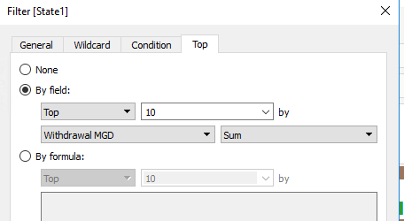

*Can you think of how you might sort the display of `categories` from most used to least used?*

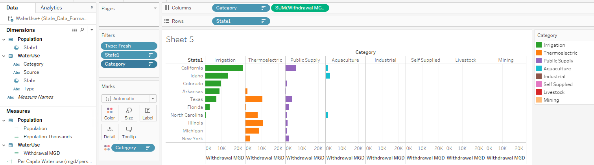

* To mimic the USGS chart (first duplicate the above sheet):

  * Remove the Top 10 State filter

  * Transpose the rows and columns

  * Sort on -- *well, if we had a longitude column we could do it...*

    ​

### Dashboards

- Now that we've created the data visualizations, we can organize the visualizations onto a dashboard.

- Add a `Dashboard` sheet

  - Notice that instead of seeing your data on the left-hand side, you now see the data visualizations you have created. 

- Add your `Total Water Use, 2000` map to the dashboard by dragging it over. 

- Add in the `Pie Chart` and the `State Water Use` charts.

  - Notice you can undock and delete some of the legends.
  - You can also change legends from full lists to drop down menus.

- Rearrange these three plots however you would like.

- Notice that the Map and the State Water Use bar charts could be <u>linked together by state.</u>
  - Click on the state map. Click on the bottom arrow and click `use as filter`.
    - Click on a state. What happens to the bar chart and the pie chart?
      - Why does the bar chart not seem to work correctly?
        - Go to the `State Bar` worksheet and turn off the `Top 10 filter`. 
      - Now try selecting multiple states.
- Save the workbook

  - Sometimes you will get an error saying it failed to saved the workbook. Click `open from Tableau Public`. This will let you sign in and you will see an older version of your workbook. Close that and then try to save your workbook again.

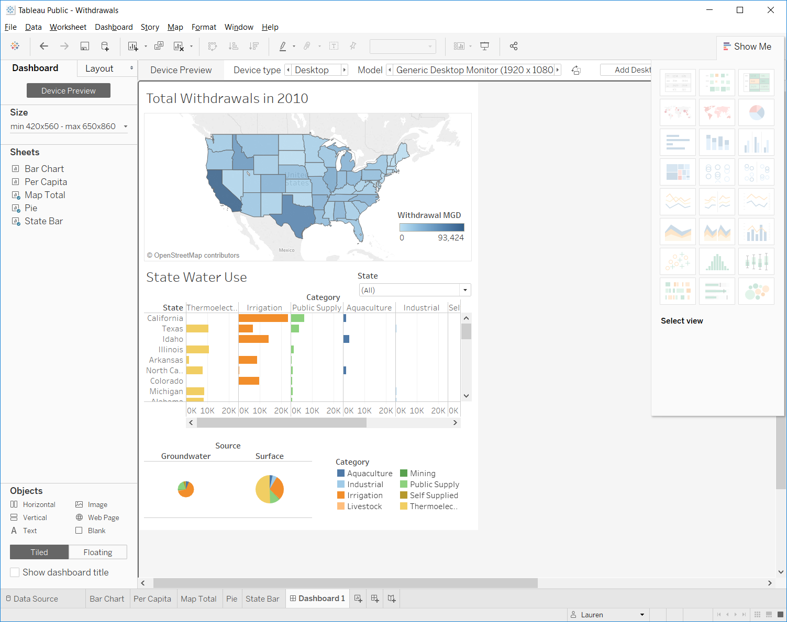

### Storyboards

A storyboard allows you to merge together multiple dashboards or charts to progressively lead a reader through a process of understanding their data.

Storyboard is similar to the dashboard, except you can also include dashboards. Each caption box at the top represents an html page. Arrange your plots and captions, add text, and tell a story about the data. Here's one example:

